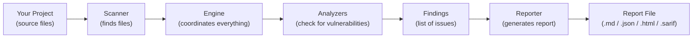
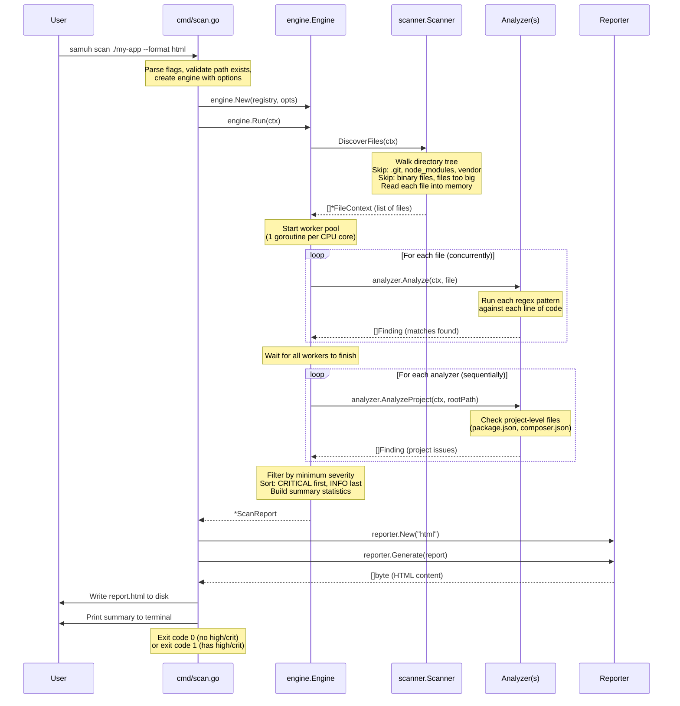
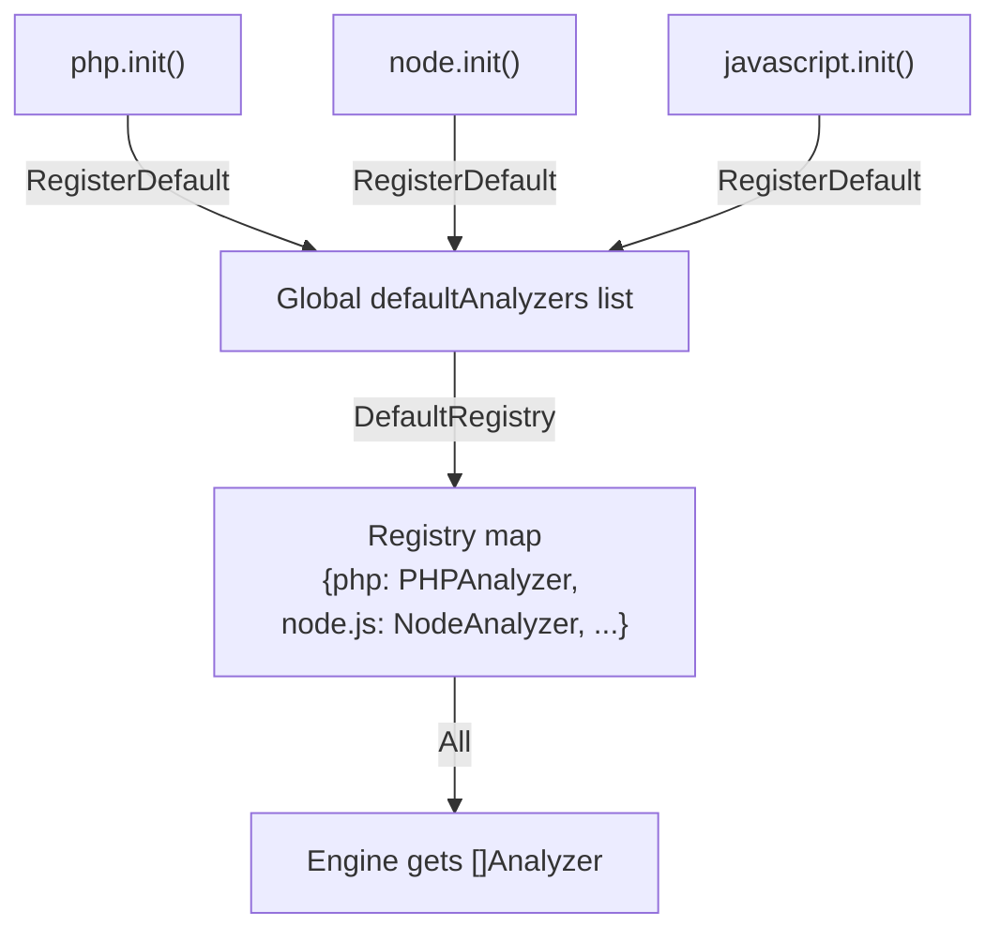
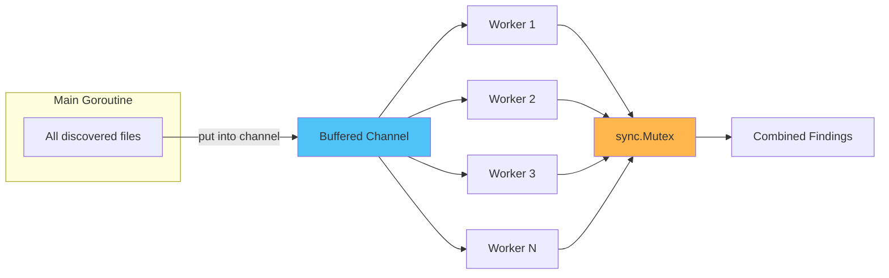

# SAMUH — Technical Manual

> **Who is this for?** Developers who know the basics of programming (variables, functions, loops, interfaces) and want to understand how SAMUH is built internally. You don't need to be a Go expert — we'll explain Go-specific concepts as they come up.

---

## Table of Contents

1. [The Big Picture](#1-the-big-picture)
2. [How the Code is Organized](#2-how-the-code-is-organized)
3. [Step-by-Step: What Happens When You Run a Scan](#3-step-by-step-what-happens-when-you-run-a-scan)
4. [The Core Data Types](#4-the-core-data-types)
5. [The Analyzer System (How Languages Are Supported)](#5-the-analyzer-system-how-languages-are-supported)
6. [The Rule Engine (How Vulnerabilities Are Detected)](#6-the-rule-engine-how-vulnerabilities-are-detected)
7. [The Reporter System (How Reports Are Generated)](#7-the-reporter-system-how-reports-are-generated)
8. [Concurrency: How SAMUH Uses All Your CPU Cores](#8-concurrency-how-samuh-uses-all-your-cpu-cores)
9. [Security Model: How SAMUH Protects Itself](#9-security-model-how-samuh-protects-itself)
10. [How to Add a New Language](#10-how-to-add-a-new-language)
11. [How to Add New Vulnerability Rules](#11-how-to-add-new-vulnerability-rules)
12. [How to Add a New Report Format](#12-how-to-add-a-new-report-format)
13. [Testing Strategy](#13-testing-strategy)
14. [Glossary](#14-glossary)

---

## 1. The Big Picture

SAMUH is a **static analysis** tool. That means it reads your source code files as text and looks for patterns that indicate security problems — it never executes, compiles, or imports your code.

Think of it like a spell checker, but instead of looking for misspelled words, it looks for dangerous code patterns like `eval($_POST['code'])` or `SELECT * FROM users WHERE id = " + userInput`.

Here's a simplified view of how it works:



Each box is a separate Go package with a clear responsibility. This separation makes it easy to modify one part without breaking others.

---

## 2. How the Code is Organized

```
samuh/
├── main.go                    ← Entry point (2 lines — just calls cmd.Execute())
├── go.mod                     ← Go module definition & dependencies
│
├── cmd/                       ← CLI commands (what the user types)
│   ├── root.go                ← Base command + global flags (--verbose, --quiet)
│   ├── scan.go                ← The "samuh scan" command
│   └── version.go             ← The "samuh version" command
│
├── internal/                  ← Private packages (can't be imported by other projects)
│   ├── engine/
│   │   └── engine.go          ← The "brain" — coordinates scanner + analyzers + report
│   │
│   ├── scanner/
│   │   └── scanner.go         ← Walks directories, discovers files, skips junk
│   │
│   ├── analyzer/              ← The interface + registry system
│   │   ├── analyzer.go        ← Defines the Analyzer interface
│   │   ├── registry.go        ← Keeps track of all registered analyzers
│   │   ├── php/               ← PHP language analyzer
│   │   │   ├── php.go         ← PHPAnalyzer struct + Analyze() method
│   │   │   └── patterns.go    ← 25+ regex patterns for PHP vulnerabilities
│   │   ├── node/              ← Node.js analyzer
│   │   │   ├── node.go        ← NodeAnalyzer + server-side detection logic
│   │   │   └── patterns.go    ← 25+ regex patterns for Node.js vulnerabilities
│   │   └── javascript/        ← JavaScript/TypeScript analyzer
│   │       ├── javascript.go  ← JavaScriptAnalyzer
│   │       └── patterns.go    ← 26+ regex patterns for JS/TS vulnerabilities
│   │
│   ├── rules/                 ← Types and reference data
│   │   ├── rule.go            ← Core types: Severity, Finding, ScanReport, etc.
│   │   ├── owasp.go           ← OWASP Top 10:2025 catalog with descriptions
│   │   └── nist.go            ← NIST CSF 2.0 catalog with descriptions
│   │
│   ├── reporter/              ← Output generators
│   │   ├── reporter.go        ← Reporter interface + factory function
│   │   ├── json.go            ← JSON output
│   │   ├── markdown.go        ← Markdown output (default)
│   │   ├── html.go            ← Standalone HTML with styling + search
│   │   └── sarif.go           ← SARIF 2.1.0 for CI/CD
│   │
│   └── util/                  ← Shared helper functions
│       ├── safepath.go        ← Path traversal prevention
│       ├── sanitize.go        ← Input/output cleaning
│       └── fileutil.go        ← File reading helpers
│
└── testdata/                  ← Sample files with intentional vulnerabilities
    ├── php/vulnerable.php
    ├── node/server.js
    └── javascript/app.jsx
```

### Why `internal/`?

In Go, anything inside an `internal/` directory is private to the module. This means if someone imports SAMUH as a library, they can only use the `cmd` package — they can't reach into `internal/engine` or `internal/analyzer` directly. This gives us freedom to change internal APIs without breaking external users.

---

## 3. Step-by-Step: What Happens When You Run a Scan

Let's trace exactly what happens when you type `samuh scan ./my-app --format html --output report.html`:



### The Key Steps in Detail

#### Step 1: CLI Parsing (`cmd/scan.go`)

The `scan` command uses [Cobra](https://github.com/spf13/cobra) to parse command-line flags. It validates:
- The target path exists and is a directory
- The output format is one of: json, html, markdown, sarif
- The max file size doesn't exceed 10 MB

It then creates an `engine.Options` struct with all the configuration and passes it to the engine.

#### Step 2: File Discovery (`internal/scanner/scanner.go`)

The scanner uses Go's `filepath.Walk()` to recursively traverse the directory tree. For each entry it encounters:

1. **Directories:** Skip if hidden (starts with `.`), or named `node_modules`/`vendor`/`bower_components`
2. **Files:** Skip if larger than `--max-file-size`, or matches an `--exclude` pattern
3. **Binary check:** Read first 512 bytes — if any null byte (`0x00`) is found, it's binary → skip
4. **Pass:** Read the full content, split into lines, detect language from extension

Each discovered file becomes a `FileContext` struct containing the path, raw bytes, split lines, detected language, and file size.

#### Step 3: Concurrent Analysis (`internal/engine/engine.go`)

The engine creates a worker pool with one goroutine per CPU core. All discovered files are placed into a buffered Go channel. Workers pull files from this channel and run every matching analyzer against them.

"Matching" means the file's extension is in the analyzer's `Extensions()` list. A `.php` file gets the PHP analyzer; a `.js` file gets BOTH the Node.js analyzer AND the JavaScript/TypeScript analyzer (they look for different patterns).

#### Step 4: Project-Level Analysis

After file scanning is complete, each analyzer gets one call to `AnalyzeProject()`. This is where analyzers check project-wide configuration files:
- **PHP:** Checks for missing `composer.lock`, insecure `minimum-stability` in `composer.json`
- **Node.js:** Checks for missing `package-lock.json`, wildcard `"*"` dependency versions, known-vulnerable packages

#### Step 5: Filter & Sort

All findings from all analyzers are combined, then:
1. Filtered by the `--severity` flag (e.g., if you set `--severity high`, MEDIUM/LOW/INFO are removed)
2. Sorted by severity (CRITICAL first, INFO last)

#### Step 6: Report Generation

A reporter object is created for the chosen format, and `Generate()` is called with the complete `ScanReport`. The reporter produces a `[]byte` (the file content), which is either written to disk or printed to stdout.

---

## 4. The Core Data Types

All core types live in `internal/rules/rule.go`. This is the "shared vocabulary" that every package in SAMUH uses.

### Severity

```go
type Severity string  // "CRITICAL", "HIGH", "MEDIUM", "LOW", "INFO"
```

Severity has two helper methods:
- `Rank() int` — returns a number (5 for CRITICAL, 1 for INFO) used for sorting
- `IsAtLeast(other) bool` — used for filtering (`"HIGH".IsAtLeast("MEDIUM")` → true)

### Finding

A `Finding` is a single detected vulnerability. It's the most important type in the system:

```
Finding
├── RuleID        "PHP-A05-001"           ← Which rule matched
├── Title         "SQL Injection"          ← Short name
├── Description   "User input in query..." ← What happened
├── Severity      CRITICAL                 ← How bad it is
├── Confidence    HIGH                     ← How sure SAMUH is
├── FilePath      "/app/db.php"            ← Where
├── Line          42                       ← Line number (1-based)
├── Column        15                       ← Column (1-based, 0 = unknown)
├── Snippet       "...code around line..." ← Context for the developer
├── MatchContent  "mysql_query($sql)"      ← The exact text that matched
├── OWASP         A05:2025-Injection       ← Which OWASP category
├── NIST          [PR-Protect]             ← Which NIST function(s)
├── CWE           "CWE-89"                ← Industry standard ID
├── Remediation   "Use prepared..."        ← How to fix it
├── References    ["https://..."]          ← Further reading
└── Language      "PHP"                    ← Source language
```

### ScanReport

The `ScanReport` wraps everything together:

```
ScanReport
├── ProjectPath     "."                    ← What was scanned
├── ScanTimestamp    "2026-09-28T..."       ← When
├── ScanDuration    "0.41s"                ← How long
├── TotalFiles      12                     ← Files examined
├── TotalFindings   38                     ← Issues found
├── Findings        [Finding, Finding...]  ← Sorted list
├── Summary                                ← Quick stats
│   ├── BySeverity  {CRITICAL: 7, HIGH: 16, ...}
│   ├── ByOWASP     {A05: 9, A04: 6, ...}
│   ├── ByNIST      {PR-Protect: 35, ...}
│   ├── ByLanguage  {PHP: 15, Node.js: 10, ...}
│   └── ByFile      {"/app/db.php": 5, ...}
├── Languages       ["PHP", "Node.js"]     ← Detected languages
└── ScannerVersion  "0.1.0"                ← SAMUH version
```

---

## 5. The Analyzer System (How Languages Are Supported)

### The Analyzer Interface

Every language analyzer must implement this Go interface (think of it like a contract):

```go
type Analyzer interface {
    Name() string                          // "PHP", "Node.js", etc.
    Extensions() []string                  // [".php", ".phtml", ...]
    Analyze(ctx, file) ([]Finding, error)  // Scan one file
    AnalyzeProject(ctx, root) ([]Finding, error) // Scan project config
}
```

This is the **Strategy Pattern** — the engine doesn't know or care about PHP or JavaScript. It just calls `Analyze()` on whatever analyzers are registered. You can add a Python analyzer tomorrow without touching the engine code.

### Self-Registration (How Analyzers "Plug In")

Go has a feature called `init()` functions — they run automatically when a package is imported. Each analyzer uses this to register itself:

```go
// In internal/analyzer/php/php.go
func init() {
    analyzer.RegisterDefault(&PHPAnalyzer{})
}
```

Then in `cmd/scan.go`, blank imports trigger these registrations:

```go
import (
    _ "samuh/internal/analyzer/php"        // Triggers php.init()
    _ "samuh/internal/analyzer/node"       // Triggers node.init()
    _ "samuh/internal/analyzer/javascript" // Triggers javascript.init()
)
```

The underscore `_` means "import this package for its side effects (init function) but don't use any of its exports directly."

When `DefaultRegistry()` is called, it collects all analyzers that registered via `RegisterDefault()` and puts them in a `Registry` — a thread-safe map of name → analyzer.



### The Node.js Analyzer's Special Trick

The Node.js and JavaScript/TypeScript analyzers both handle `.js` files. To avoid duplicate noise, the Node.js analyzer checks if a file "looks like" Node.js before scanning it:

```go
nodeIndicator := regexp.MustCompile(
    `(?i)(require\(|module\.exports|process\.|Buffer\.|__dirname|__filename|express\()`)

// In Analyze():
contentStr := strings.Join(file.Lines, "\n")
if !a.nodeIndicator.MatchString(contentStr) {
    return findings, nil  // Not Node.js → skip silently
}
```

If a `.js` file doesn't contain `require()`, `module.exports`, `process.`, or similar Node.js markers, the Node analyzer skips it and lets the JS/TS analyzer handle it instead.

---

## 6. The Rule Engine (How Vulnerabilities Are Detected)

### Pattern-Based Matching

Each analyzer defines its vulnerability rules as **compiled regular expressions** (regex). A pattern looks like this:

```go
type pattern struct {
    Regex *regexp.Regexp  // The compiled regex
    Rule  rules.Rule       // Metadata about the vulnerability
}
```

And a concrete example from the PHP analyzer:

```go
{
    Regex: regexp.MustCompile(`(?i)(mysql_query|mysqli_query)\s*\([^)]*\$_(GET|POST|REQUEST|COOKIE)`),
    Rule: rules.Rule{
        ID:          "PHP-A05-001",
        Title:       "SQL Injection via User Input",
        Severity:    rules.SeverityCritical,
        Confidence:  rules.ConfidenceHigh,
        OWASP:       rules.OWASPA05,
        NIST:        []rules.NISTFunction{rules.NISTProtect},
        CWE:         "CWE-89",
        Remediation: "Use prepared statements with parameterized queries.",
    },
}
```

This regex matches lines like:
- `mysql_query("SELECT * FROM users WHERE id = " . $_GET['id'])`
- `mysqli_query($conn, "DELETE FROM " . $_POST['table'])`

### How Scanning Works (per file)

The analyzer loops through every line of every file and checks every pattern:

```
for each line in file:
    for each pattern:
        if pattern.regex matches line:
            create a Finding with the rule's metadata
            attach the file path, line number, code snippet
            add to findings list
```

This is O(lines × patterns) per file, but because Go's regex engine (RE2) guarantees **linear-time matching** (no backtracking), it's fast and predictable.

### Why Pre-Compiled Regexes?

All regexes are compiled at startup using `regexp.MustCompile()` (a package-level variable). This means:
- **Performance:** Regex compilation happens once, not on every file scan
- **Fail-fast:** If a regex is invalid, the program panics immediately at startup, not silently during a scan
- **ReDoS-safe:** Go's RE2 engine is immune to Regular Expression Denial-of-Service attacks

### Rule ID Convention

Rule IDs follow the pattern `{LANG}-{OWASP_SHORTCODE}-{NUMBER}`:

| Part | Meaning | Example |
|---|---|---|
| `LANG` | Language prefix | `PHP`, `NODE`, `JS` |
| `OWASP_SHORTCODE` | OWASP category reference | `A05` (Injection), `A04` (Crypto) |
| `NUMBER` | Sequential rule number | `001`, `002`, `003` |

Examples: `PHP-A05-001` (PHP SQL Injection), `NODE-A04-003` (Node.js hardcoded secret), `JS-INJ-006` (JS eval injection)

---

## 7. The Reporter System (How Reports Are Generated)

### The Reporter Interface

```go
type Reporter interface {
    Format() Format
    Generate(report *ScanReport) ([]byte, error)
    FileExtension() string
}
```

Every reporter takes a `ScanReport` and returns raw bytes. The engine doesn't care if those bytes are JSON, HTML, or anything else.

### Reporter Factory

`reporter.New(format)` is a factory function that returns the right reporter:

```go
func New(format Format) (Reporter, error) {
    switch format {
    case FormatJSON:     return &JSONReporter{}, nil
    case FormatHTML:     return &HTMLReporter{}, nil
    case FormatMarkdown: return &MarkdownReporter{}, nil
    case FormatSARIF:    return &SARIFReporter{}, nil
    }
}
```

### How Each Reporter Works

| Reporter | How It Generates Output |
|---|---|
| **JSON** | `json.MarshalIndent(report)` — serializes the whole ScanReport to pretty JSON |
| **Markdown** | Builds a `bytes.Buffer` with string formatting — tables, headings, code blocks |
| **HTML** | Uses Go's `html/template` to render a single-file HTML page with inline CSS/JS |
| **SARIF** | Builds SARIF 2.1.0 structs, maps Severity → SARIF levels, then `json.MarshalIndent` |

### Why `html/template` Matters for Security

Go has two template packages: `text/template` (no escaping) and `html/template` (auto-escaping). SAMUH uses `html/template`, which means if the scanned code contains something like `<script>alert('xss')</script>`, it gets automatically escaped to `&lt;script&gt;alert(&#39;xss&#39;)&lt;/script&gt;` in the HTML report. This prevents the scanned code from executing in the report viewer's browser.

---

## 8. Concurrency: How SAMUH Uses All Your CPU Cores

### The Worker Pool Pattern

SAMUH uses a **worker pool** — a common Go concurrency pattern:



Here's how it works:

1. **All files are loaded into a buffered channel.** A channel is like a thread-safe queue in Go.
2. **N worker goroutines** are created, where N = the number of CPU cores on your machine (e.g., 8 on a typical laptop, 16 on a workstation).
3. Each worker pulls one file at a time from the channel and runs all matching analyzers on it.
4. When a worker finds vulnerabilities, it **locks a mutex** (a thread lock), appends findings to a shared list, and unlocks.
5. When the channel is empty, workers finish. The main goroutine waits for all workers using a `sync.WaitGroup`.

### Why This Design?

- **Channel-based:** Workers never fight over which file to process — the channel handles distribution automatically
- **Bounded parallelism:** At most N files are being analyzed simultaneously, preventing memory exhaustion
- **Context-aware:** Workers check for context cancellation between files, so the 5-minute timeout is respected

### Why Not Just Analyze Everything Sequentially?

On a project with 1,000 files and a 16-core CPU, the worker pool can analyze ~16 files simultaneously. Since file analysis is CPU-bound (regex matching), this gives a near-linear speedup.

---

## 9. Security Model: How SAMUH Protects Itself

SAMUH is designed to safely process **untrusted source code**. Here's what that means and what mitigations are in place:

### Threat: Malicious Code in Scanned Files

**Scenario:** An attacker puts `<script>document.cookie</script>` in their source code. When a developer generates an HTML report and opens it, the script runs in their browser.

**Mitigation:** The HTML reporter uses `html/template`, which automatically escapes all dynamic content. The malicious script becomes harmless display text.

### Threat: Path Traversal

**Scenario:** A project contains a symlink like `passwords -> /etc/shadow`. The scanner follows it and reads sensitive system files.

**Mitigation:** `internal/util/safepath.go` resolves symlinks via `filepath.EvalSymlinks()` and verifies the resolved path is still within the project directory. The scanner also skips hidden directories (`.git`, `.ssh`, etc.).

### Threat: Denial of Service via Giant Files

**Scenario:** A project contains a 500 MB auto-generated file. Scanning it would consume all memory and time.

**Mitigation:** The scanner enforces `--max-file-size` (default 1 MB, hard cap 10 MB). Files exceeding this are silently skipped. The 5-minute context timeout provides a global safety net.

### Threat: ReDoS (Regular Expression Denial of Service)

**Scenario:** A crafted input causes a regex pattern to take exponential time, hanging the scanner.

**Mitigation:** Go's `regexp` package implements the RE2 algorithm, which **guarantees linear-time matching**. Unlike PCRE (used in Python, PHP, JavaScript), RE2 has no backtracking, so ReDoS is impossible. This is why SAMUH doesn't support lookaheads/lookbehinds — they're not part of RE2.

### Threat: Command Injection

**Scenario:** SAMUH shells out to an external tool, and a malicious filename causes command injection.

**Mitigation:** SAMUH makes **zero `os/exec` calls**. It never shells out to any external process. All analysis is done purely with Go's standard library.

### Threat: Dependency Supply Chain

**Mitigation:** SAMUH has exactly **one** third-party dependency: `spf13/cobra` (a mature, widely-used CLI framework). Everything else uses Go's standard library. This minimizes the supply chain attack surface.

---

## 10. How to Add a New Language

Adding support for a new language (e.g., Python) requires **zero changes to existing code**. You just create a new package and add a blank import.

### Step 1: Create the Package

```
internal/analyzer/python/
├── python.go      ← Analyzer implementation
└── patterns.go    ← Vulnerability regex patterns
```

### Step 2: Define Patterns (`patterns.go`)

```go
package python

import (
    "regexp"
    "samuh/internal/rules"
)

type pattern struct {
    regex *regexp.Regexp
    rule  rules.Rule
}

var pythonPatterns = []pattern{
    {
        regex: regexp.MustCompile(`\beval\s*\(`),
        rule: rules.Rule{
            ID:          "PY-A05-001",
            Title:       "Use of eval()",
            Description: "eval() executes arbitrary Python code...",
            Severity:    rules.SeverityHigh,
            Confidence:  rules.ConfidenceHigh,
            OWASP:       rules.OWASPA05,
            NIST:        []rules.NISTFunction{rules.NISTProtect},
            CWE:         "CWE-94",
            Remediation: "Use ast.literal_eval() for safe parsing.",
        },
    },
    // ... add 25+ more patterns here
}
```

### Step 3: Implement the Analyzer (`python.go`)

```go
package python

import (
    "context"
    "strings"

    "samuh/internal/analyzer"
    "samuh/internal/rules"
)

type PythonAnalyzer struct{}

func (a *PythonAnalyzer) Name() string           { return "Python" }
func (a *PythonAnalyzer) Extensions() []string    { return []string{".py"} }

func (a *PythonAnalyzer) Analyze(ctx context.Context, file analyzer.FileContext) ([]rules.Finding, error) {
    var findings []rules.Finding

    for i, line := range file.Lines {
        select {
        case <-ctx.Done():
            return findings, ctx.Err()
        default:
        }

        for _, pat := range pythonPatterns {
            if pat.regex.MatchString(line) {
                findings = append(findings, rules.Finding{
                    RuleID:       pat.rule.ID,
                    Title:        pat.rule.Title,
                    Description:  pat.rule.Description,
                    Severity:     pat.rule.Severity,
                    Confidence:   pat.rule.Confidence,
                    FilePath:     file.Path,
                    Line:         i + 1,
                    Snippet:      strings.TrimSpace(line),
                    MatchContent: pat.regex.FindString(line),
                    OWASP:        pat.rule.OWASP,
                    NIST:         pat.rule.NIST,
                    CWE:          pat.rule.CWE,
                    Remediation:  pat.rule.Remediation,
                    References:   pat.rule.References,
                    Language:     "Python",
                })
            }
        }
    }
    return findings, nil
}

func (a *PythonAnalyzer) AnalyzeProject(ctx context.Context, root string) ([]rules.Finding, error) {
    // Could check requirements.txt for known-vulnerable packages
    return nil, nil
}

// Self-register when this package is imported
func init() {
    analyzer.RegisterDefault(&PythonAnalyzer{})
}
```

### Step 4: Add the Import

In `cmd/scan.go`, add one line:

```go
import (
    _ "samuh/internal/analyzer/python"  // ← Add this line
)
```

### Step 5: Rebuild

```bash
go build -o samuh .
```

That's it. The Python analyzer is now active and will scan `.py` files automatically.

---

## 11. How to Add New Vulnerability Rules

Adding a new rule to an existing analyzer is even simpler — just add an entry to the patterns list.

### Example: Detecting `pickle.loads()` in Python

Open `internal/analyzer/python/patterns.go` and add:

```go
{
    regex: regexp.MustCompile(`\bpickle\.loads?\s*\(`),
    rule: rules.Rule{
        ID:          "PY-A08-001",
        Title:       "Insecure Deserialization (pickle)",
        Description: "pickle.load() can execute arbitrary code...",
        Severity:    rules.SeverityCritical,
        Confidence:  rules.ConfidenceHigh,
        OWASP:       rules.OWASPA08,
        NIST:        []rules.NISTFunction{rules.NISTProtect},
        CWE:         "CWE-502",
        Remediation: "Use json.loads() or a safe serialization format.",
    },
},
```

The analyzer's `Analyze()` loop automatically picks up any new patterns in the slice. No other changes needed.

### Writing Good Regex Patterns — Tips

1. **Use `(?i)` for case-insensitive matching** when function names might vary in case
2. **Remember: Go uses RE2** — no `(?!...)` lookaheads, no `(?<=...)` lookbehinds
3. **Anchor where possible** — `\b` (word boundary) reduces false positives
4. **Test your regex** at [regex101.com](https://regex101.com/) with the "Golang" flavor
5. **Set appropriate Confidence** — if the pattern might match safe code, use `ConfidenceLow`

---

## 12. How to Add a New Report Format

### Step 1: Implement the Reporter Interface

Create `internal/reporter/csv.go`:

```go
package reporter

import (
    "bytes"
    "fmt"
    "samuh/internal/rules"
)

type CSVReporter struct{}

func (r *CSVReporter) Format() Format           { return "csv" }
func (r *CSVReporter) FileExtension() string     { return ".csv" }

func (r *CSVReporter) Generate(report *rules.ScanReport) ([]byte, error) {
    var buf bytes.Buffer
    buf.WriteString("Severity,RuleID,Title,File,Line,OWASP,CWE\n")
    for _, f := range report.Findings {
        buf.WriteString(fmt.Sprintf("%s,%s,%s,%s,%d,%s,%s\n",
            f.Severity, f.RuleID, f.Title, f.FilePath, f.Line, f.OWASP, f.CWE))
    }
    return buf.Bytes(), nil
}
```

### Step 2: Register in the Factory

In `internal/reporter/reporter.go`:

```go
const FormatCSV Format = "csv"

func ParseFormat(s string) (Format, error) {
    // ... existing cases ...
    case "csv":
        return FormatCSV, nil
}

func New(format Format) (Reporter, error) {
    // ... existing cases ...
    case FormatCSV:
        return &CSVReporter{}, nil
}
```

---

## 13. Testing Strategy

### Unit Tests

Test each component in isolation:
- `util/safepath_test.go` — Path traversal with `../`, symlinks, absolute paths
- `util/fileutil_test.go` — Binary detection, line reading, snippet extraction at boundaries
- `rules/rule_test.go` — Severity ranking, `IsAtLeast()` comparisons

### Integration Tests

Run the full pipeline against `testdata/`:
- Verify known vulnerabilities are detected (true positives)
- Verify clean code produces no findings (no false positives)
- Verify all report formats produce valid output

### Running Tests

```bash
# Run all tests with verbose output and race detection
go test ./... -v -race -count=1

# Run static analysis
go vet ./...

# Run a scan against the test fixtures
./samuh scan testdata --verbose
```

---

## 14. Glossary

| Term | Definition |
|---|---|
| **Static Analysis** | Examining source code without executing it |
| **Regex / Regular Expression** | A pattern-matching language for strings |
| **RE2** | Google's regex engine used by Go — guarantees linear-time matching |
| **ReDoS** | A denial-of-service attack using crafted input that makes regex engines hang |
| **OWASP Top 10** | The 10 most critical web application security risks (2025 edition) |
| **NIST CSF** | Cybersecurity Framework by NIST — organizes security into 6 functions |
| **CWE** | Common Weakness Enumeration — a standard list of software weakness types |
| **SARIF** | Static Analysis Results Interchange Format — a JSON standard for tool results |
| **Goroutine** | A lightweight thread in Go (costs ~2 KB of memory each) |
| **Channel** | A Go primitive for safe communication between goroutines |
| **Mutex** | A lock that prevents two goroutines from modifying the same data simultaneously |
| **Worker Pool** | A concurrency pattern where N goroutines process items from a shared queue |
| **Interface** | A Go type that defines a set of methods — any struct implementing those methods "satisfies" the interface |
| **init()** | A Go function that runs automatically when its package is imported |
| **Blank Import** | `import _ "pkg"` — imports a package only for its side effects (init function) |
| **html/template** | Go's HTML template engine with automatic XSS-safe escaping |
