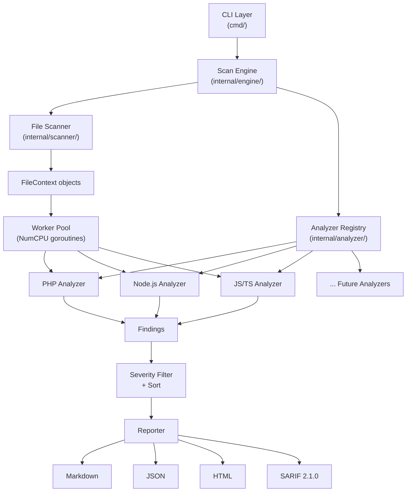
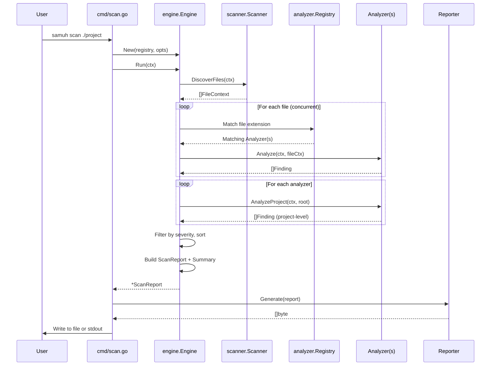
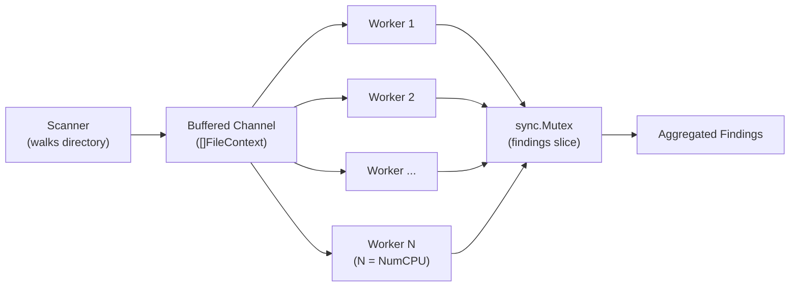

# SAMUH — Technical Manual

This document provides a comprehensive guide to SAMUH's architecture, internals, and extension mechanisms. It is intended for contributors, auditors, and developers looking to understand, modify, or extend the scanner.

## Table of Contents

1. [System Architecture](#system-architecture)
2. [Package Structure](#package-structure)
3. [Data Flow](#data-flow)
4. [Core Types](#core-types)
5. [Analyzer System](#analyzer-system)
6. [Rule Engine](#rule-engine)
7. [Report Generation](#report-generation)
8. [Concurrency Model](#concurrency-model)
9. [Security Model](#security-model)
10. [Extending SAMUH](#extending-samuh)
11. [Testing Strategy](#testing-strategy)

---

## System Architecture

SAMUH follows a layered pipeline architecture with clear separation of concerns:



### Design Principles

1. **Separation of concerns** — Each package has a single responsibility
2. **Interface-driven** — Analyzers and reporters are defined by interfaces, not concrete types
3. **Self-registration** — Language analyzers register themselves via `init()` functions
4. **Zero shell-out** — No `os/exec` calls; all analysis is pure Go
5. **Minimal dependencies** — Only `spf13/cobra` for CLI; everything else is stdlib

---

## Package Structure

```
samuh/
├── main.go                              # Entry point → cmd.Execute()
├── go.mod / go.sum                      # Module definition
├── LICENSE                              # MIT License
├── README.md                            # User documentation
├── TECHMANUAL.md                        # This file
│
├── cmd/                                 # CLI layer
│   ├── root.go                          # Root cobra command, global flags
│   ├── scan.go                          # 'scan' subcommand, orchestration
│   └── version.go                       # 'version' subcommand
│
├── internal/                            # Private packages
│   ├── engine/
│   │   └── engine.go                    # Scan orchestrator, worker pool
│   │
│   ├── scanner/
│   │   └── scanner.go                   # File discovery, filtering, safety
│   │
│   ├── analyzer/
│   │   ├── analyzer.go                  # Analyzer interface + FileContext
│   │   ├── registry.go                  # Thread-safe analyzer registry
│   │   ├── php/
│   │   │   ├── php.go                   # PHP analyzer implementation
│   │   │   └── patterns.go             # 25+ PHP vulnerability regexes
│   │   ├── node/
│   │   │   ├── node.go                  # Node.js analyzer implementation
│   │   │   └── patterns.go             # 25+ Node.js vulnerability regexes
│   │   └── javascript/
│   │       ├── javascript.go            # JS/TS analyzer implementation
│   │       └── patterns.go             # 26+ JS/TS vulnerability regexes
│   │
│   ├── rules/
│   │   ├── rule.go                      # Core types: Finding, Severity, etc.
│   │   ├── owasp.go                     # OWASP Top 10:2025 catalog
│   │   └── nist.go                      # NIST CSF 2.0 catalog
│   │
│   ├── reporter/
│   │   ├── reporter.go                  # Reporter interface + factory
│   │   ├── json.go                      # JSON reporter
│   │   ├── html.go                      # Standalone HTML reporter
│   │   ├── markdown.go                  # Markdown reporter (default)
│   │   └── sarif.go                     # SARIF 2.1.0 reporter
│   │
│   └── util/
│       ├── safepath.go                  # Path traversal prevention
│       ├── sanitize.go                  # Input/output sanitization
│       └── fileutil.go                  # File I/O helpers
│
└── testdata/                            # Test fixtures with known vulns
    ├── php/vulnerable.php
    ├── node/server.js
    └── javascript/app.jsx
```

---

## Data Flow



---

## Core Types

All core types are defined in `internal/rules/rule.go`:

### Severity

```go
type Severity string  // CRITICAL, HIGH, MEDIUM, LOW, INFO

func (s Severity) Rank() int        // Numeric rank for sorting (5=critical, 1=info)
func (s Severity) IsAtLeast(other Severity) bool  // Comparison helper
```

### Finding

A `Finding` represents a single vulnerability instance:

| Field | Type | Description |
|---|---|---|
| `RuleID` | `string` | Unique rule identifier (e.g., `"PHP-A05-001"`) |
| `Title` | `string` | Short description |
| `Description` | `string` | Detailed context |
| `Severity` | `Severity` | CRITICAL through INFO |
| `Confidence` | `Confidence` | HIGH, MEDIUM, or LOW |
| `FilePath` | `string` | Absolute path to file |
| `Line` | `int` | 1-based line number |
| `Snippet` | `string` | Code context (±3 lines) |
| `MatchContent` | `string` | Exact matched text |
| `OWASP` | `OWASPCategory` | OWASP Top 10:2025 category |
| `NIST` | `[]NISTFunction` | NIST CSF 2.0 functions |
| `CWE` | `string` | CWE identifier |
| `Remediation` | `string` | Fix guidance |
| `References` | `[]string` | URLs to documentation |
| `Language` | `string` | Source language |

### ScanReport

Aggregated results with summary statistics:

| Field | Description |
|---|---|
| `ProjectPath` | Root directory scanned |
| `ScanTimestamp` | ISO 8601 start time |
| `ScanDuration` | Human-readable duration |
| `TotalFiles` | Number of files scanned |
| `TotalFindings` | Number of findings |
| `Findings` | Sorted list of all findings |
| `Summary` | Aggregate counts by severity, OWASP, NIST, language, file |
| `Languages` | Languages detected |

---

## Analyzer System

### The Analyzer Interface

Every language analyzer must implement this interface (defined in `internal/analyzer/analyzer.go`):

```go
type Analyzer interface {
    // Name returns the human-readable name (e.g., "PHP")
    Name() string

    // Extensions returns file extensions this analyzer handles
    Extensions() []string

    // Analyze scans a single file for vulnerabilities
    Analyze(ctx context.Context, file FileContext) ([]rules.Finding, error)

    // AnalyzeProject performs project-level checks (e.g., package.json)
    AnalyzeProject(ctx context.Context, projectRoot string) ([]rules.Finding, error)
}
```

### Self-Registration Pattern

Analyzers register themselves using `init()` functions. This means adding a new language requires:
1. Writing the analyzer package
2. Adding a blank import in `cmd/scan.go`

No changes to the engine, registry, or any other existing code.

```go
// In internal/analyzer/php/php.go
func init() {
    analyzer.RegisterDefault(&PHPAnalyzer{})
}
```

```go
// In cmd/scan.go — blank import triggers init()
import _ "samuh/internal/analyzer/php"
```

### FileContext

The `FileContext` struct provides everything an analyzer needs:

```go
type FileContext struct {
    Path         string   // Absolute file path
    RelativePath string   // Path relative to project root
    Content      []byte   // Raw file bytes
    Lines        []string // Pre-split lines
    Language     string   // Detected language
    Size         int64    // File size in bytes
}
```

### Extension Overlap

Both the **Node.js** and **JavaScript/TypeScript** analyzers handle `.js` files. This is by design:
- The **Node.js analyzer** detects server-side patterns (require, express, child_process) and skips files that don't look like Node.js code
- The **JS/TS analyzer** detects client-side patterns (DOM XSS, localStorage, React/Vue/Angular)
- Both can report findings for the same file without conflict

---

## Rule Engine

### Pattern Structure

Each language analyzer defines its rules as compiled regex patterns with metadata:

```go
type pattern struct {
    Regex *regexp.Regexp  // Pre-compiled, package-level var
    Rule  rules.Rule      // Full metadata (severity, OWASP, NIST, CWE, etc.)
}
```

All regexes are compiled at package init time via `regexp.MustCompile()`. This ensures:
- **No runtime compilation overhead** — patterns are compiled once at startup
- **Fail-fast on bad regexes** — invalid patterns panic at startup, not during scanning
- **ReDoS resistance** — Go's `regexp` package uses the RE2 engine, which guarantees linear time matching (no backtracking catastrophes)

### OWASP Top 10:2025 Categories

| Constant | Category |
|---|---|
| `OWASPA01` | Broken Access Control |
| `OWASPA02` | Security Misconfiguration |
| `OWASPA03` | Software Supply Chain Failures |
| `OWASPA04` | Cryptographic Failures |
| `OWASPA05` | Injection |
| `OWASPA06` | Insecure Design |
| `OWASPA07` | Authentication Failures |
| `OWASPA08` | Software or Data Integrity Failures |
| `OWASPA09` | Security Logging and Monitoring Failures |
| `OWASPA10` | Mishandling of Exceptional Conditions |

### NIST CSF 2.0 Functions

| Constant | Function |
|---|---|
| `NISTGovern` | GV — Govern |
| `NISTIdentify` | ID — Identify |
| `NISTProtect` | PR — Protect |
| `NISTDetect` | DE — Detect |
| `NISTRespond` | RS — Respond |
| `NISTRecover` | RC — Recover |

---

## Report Generation

### Reporter Interface

```go
type Reporter interface {
    Format() Format
    Generate(report *rules.ScanReport) ([]byte, error)
    FileExtension() string
}
```

### Available Formats

| Format | Use Case | Notes |
|---|---|---|
| **Markdown** | Human review, PRs | Default. Severity emojis, grouped findings |
| **JSON** | Programmatic processing | Pretty-printed, machine-readable |
| **HTML** | Standalone reports | Single-file, dark/light theme, collapsible sections, filters |
| **SARIF** | CI/CD integration | SARIF 2.1.0 for GitHub Code Scanning, Azure DevOps |

### HTML Report Security

The HTML reporter uses Go's `html/template` package (not `text/template`). This provides **contextual auto-escaping** — code snippets from scanned files are safely escaped, preventing XSS if a malicious codebase tries to inject scripts via its own source code.

---

## Concurrency Model



1. The **Scanner** walks the directory tree and builds a list of `FileContext` objects
2. All files are fed into a **buffered channel**
3. **N worker goroutines** (where N = `runtime.NumCPU()`) consume from the channel
4. Each worker runs all matching analyzers on each file
5. Findings are appended to a shared slice under a **`sync.Mutex`**
6. After all workers finish, **project-level analysis** runs sequentially
7. Findings are filtered by minimum severity and sorted (critical first)
8. The `ScanReport` is built with summary statistics

Context cancellation is checked between each file, ensuring the scan respects timeouts (default: 5 minutes).

---

## Security Model

SAMUH is designed to safely process **untrusted source code**. The following mitigations are in place:

### Path Traversal Prevention
- `internal/util/safepath.go` resolves all paths via `filepath.EvalSymlinks` and verifies they remain within the project directory
- Symlinks that escape the project root are rejected
- Hidden directories (`.git`, `.svn`, `.hg`) are always skipped
- Dependency directories (`node_modules`, `vendor`, `bower_components`) are skipped

### Input Safety
- Maximum file size enforcement (default 1MB, hard cap at 10MB) prevents DoS via giant files
- Binary file detection (null byte check in first 512 bytes) skips non-text files
- Code snippets in reports are truncated to safe lengths via `SanitizeSnippet()`

### Output Safety
- HTML reports use `html/template` with contextual auto-escaping
- No `text/template` usage anywhere in the codebase
- JSON output uses `json.Marshal` which safely escapes all strings

### Execution Safety
- **Zero `os/exec` calls** — the scanner never shells out to external processes
- All regex patterns use Go's RE2 engine (guaranteed linear-time, no ReDoS)
- All regexes are pre-compiled at startup (`regexp.MustCompile`)
- Context-based timeouts prevent runaway scans

### Dependency Minimalism
- Only one third-party dependency: `spf13/cobra` (CLI framework)
- All analysis, parsing, and reporting uses Go standard library

---

## Extending SAMUH

### Adding a New Language Analyzer

To add support for a new language (e.g., Python):

**Step 1:** Create the package directory:
```
internal/analyzer/python/
├── python.go     # Analyzer implementation
└── patterns.go   # Vulnerability patterns
```

**Step 2:** Define patterns in `patterns.go`:
```go
package python

import (
    "regexp"
    "samuh/internal/rules"
)

type pattern struct {
    Regex *regexp.Regexp
    Rule  rules.Rule
}

var patterns = []pattern{
    {
        Regex: regexp.MustCompile(`(?i)\beval\s*\(`),
        Rule: rules.Rule{
            ID:          "PY-INJ-001",
            Title:       "Use of eval()",
            Severity:    rules.SeverityHigh,
            Confidence:  rules.ConfidenceHigh,
            OWASP:       rules.OWASPA05,
            NIST:        []rules.NISTFunction{rules.NISTProtect},
            CWE:         "CWE-94",
            Remediation: "Avoid eval(). Use ast.literal_eval() for safe parsing.",
        },
    },
    // ... more patterns
}
```

**Step 3:** Implement the Analyzer in `python.go`:
```go
package python

import (
    "context"
    "samuh/internal/analyzer"
    "samuh/internal/rules"
)

type PythonAnalyzer struct{}

func (a *PythonAnalyzer) Name() string                { return "Python" }
func (a *PythonAnalyzer) Extensions() []string         { return []string{".py"} }

func (a *PythonAnalyzer) Analyze(ctx context.Context, file analyzer.FileContext) ([]rules.Finding, error) {
    var findings []rules.Finding
    for lineNum, line := range file.Lines {
        for _, p := range patterns {
            if p.Regex.MatchString(line) {
                findings = append(findings, rules.Finding{
                    RuleID:   p.Rule.ID,
                    Title:    p.Rule.Title,
                    // ... fill all fields from p.Rule
                    FilePath: file.Path,
                    Line:     lineNum + 1,
                    Language: "Python",
                })
            }
        }
    }
    return findings, nil
}

func (a *PythonAnalyzer) AnalyzeProject(ctx context.Context, root string) ([]rules.Finding, error) {
    return nil, nil // Project-level checks (e.g., requirements.txt)
}

func init() {
    analyzer.RegisterDefault(&PythonAnalyzer{})
}
```

**Step 4:** Add the blank import in `cmd/scan.go`:
```go
import _ "samuh/internal/analyzer/python"
```

That's it — rebuild and the Python analyzer is active.

### Adding New Rules to an Existing Analyzer

1. Open the relevant `patterns.go` file
2. Add a new entry to the patterns slice with:
   - A compiled regex (`regexp.MustCompile(...)`)
   - Complete rule metadata (ID, title, severity, OWASP, NIST, CWE, remediation)
3. The analyzer's `Analyze()` loop automatically picks up new patterns

**Rule ID convention:** `{LANG}-{OWASP_SHORT}-{SEQ}` — e.g., `PHP-A05-001`, `NODE-A04-003`, `JS-INJ-002`

---

## Testing Strategy

### Unit Tests
Test utility functions for edge cases:
- Path traversal with symlinks, `..`, and absolute paths
- Binary file detection with various encodings
- Snippet extraction at file boundaries
- Severity comparison and ranking

### Integration Tests
Run the full engine against `testdata/` fixtures:
- Verify expected findings are detected
- Verify correct OWASP/NIST mappings
- Verify all report formats generate valid output

### Security Tests
- Supply symlinks pointing outside the project root → should be rejected
- Supply files exceeding max size → should be skipped
- Supply binary files → should be skipped
- Include malicious HTML/JS in scanned code → HTML report should escape it safely

### Running Tests
```bash
go test ./... -v -race -count=1
go vet ./...
```
